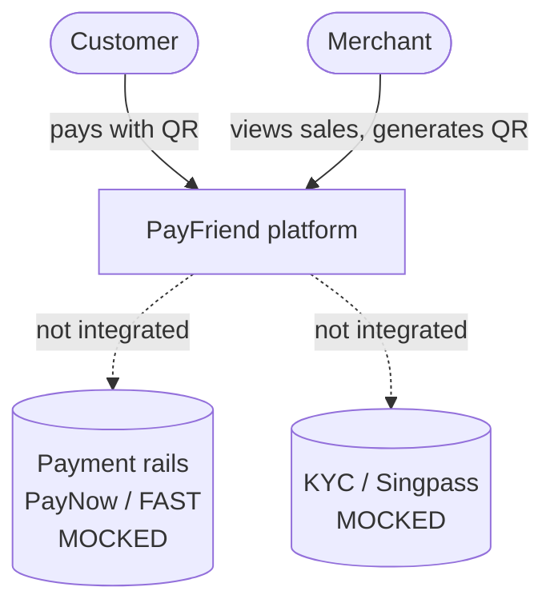
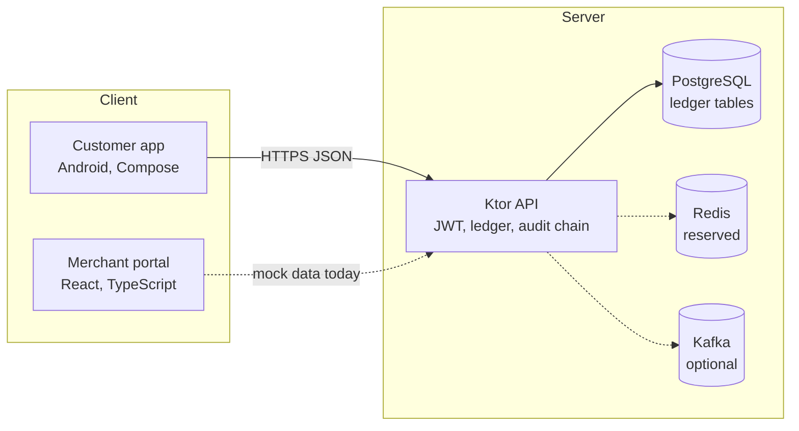
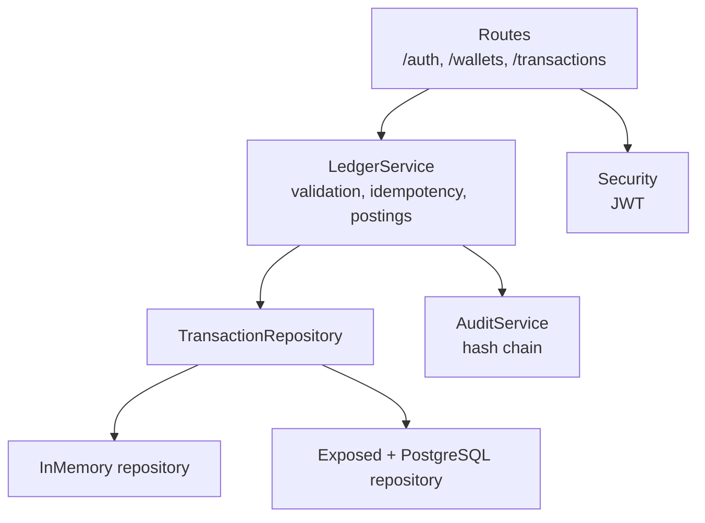
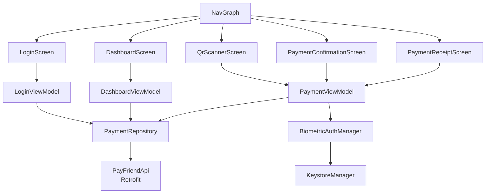

# C4 Diagrams

Rendered by GitHub using Mermaid.

## Level 1: System context

```mermaid
flowchart TB
  customer([Customer])
  merchant([Merchant])
  pf[PayFriend platform]
  rails[(Payment rails<br/>PayNow / FAST<br/>MOCKED)]
  kyc[(KYC / Singpass<br/>MOCKED)]

  customer -->|pays with QR| pf
  merchant -->|views sales, generates QR| pf
  pf -.->|not integrated| rails
  pf -.->|not integrated| kyc
```

## Level 2: Containers

```mermaid
flowchart LR
  subgraph Client
    app[Customer app<br/>Android, Compose]
    portal[Merchant portal<br/>React, TypeScript]
  end
  subgraph Server
    api[Ktor API<br/>JWT, ledger, audit chain]
    db[(PostgreSQL<br/>ledger tables)]
    redis[(Redis<br/>reserved)]
    kafka[(Kafka<br/>optional)]
  end

  app -->|HTTPS JSON| api
  portal -.->|mock data today| api
  api --> db
  api -.-> redis
  api -.-> kafka
```

## Level 3: Backend components

```mermaid
flowchart TB
  routes[Routes<br/>/auth, /wallets, /transactions] --> ledger[LedgerService<br/>validation, idempotency, postings]
  routes --> sec[Security<br/>JWT]
  ledger --> repo[TransactionRepository]
  ledger --> audit[AuditService<br/>hash chain]
  repo --> mem[InMemory repository]
  repo --> pg[Exposed + PostgreSQL repository]
```

## Level 3: Android app

```mermaid
flowchart TB
  nav[NavGraph] --> login[LoginScreen] & dash[DashboardScreen] & scan[QrScannerScreen] & confirm[PaymentConfirmationScreen] & receipt[PaymentReceiptScreen]
  login --> lvm[LoginViewModel]
  dash --> dvm[DashboardViewModel]
  scan & confirm & receipt --> pvm[PaymentViewModel]
  lvm & dvm & pvm --> repo[PaymentRepository]
  pvm --> bio[BiometricAuthManager]
  bio --> ks[KeystoreManager]
  repo --> api[PayFriendApi<br/>Retrofit]
```
